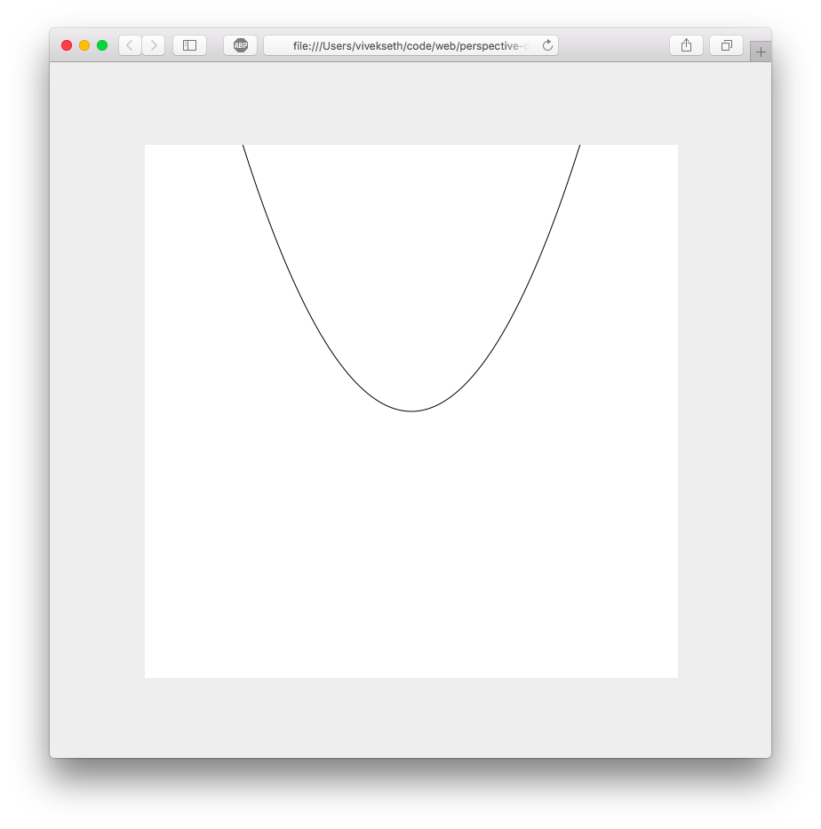

# Drawing Parametric Functions with the HTML Canvas


## What are parametric functions?

You are probably familiar with graphs that look like this:

    y = 5x^2 - 10.



The **traditional** approach to graphing functions involves mapping each x to 1 and only 1 y point. This approach has some drawbacks. For example, since there can only be 1 `y` point for each `x`, you cannot draw a circle this way without a "hack". To draw a circle you need two functions: one for the top half and another for the bottom half.

    y = sqrt(R^2 - x^2)
    y = -sqrt(R^2 - x^2)

Drawing graphs with **parametric** functions loosens this restriction. Parametric graphs use two functions, one for the X coordinate and another for the Y coordinate. Each of these functions has one input `t`. To visualize a parametric graph you input some `t` and plot whatever point ends up at `(x(t), y(t))`. Since you describe the x and y separately, you are no longer restricted to graphs that only have 1 y for each x. For example, a circle could be drawn with the following parametric functions:

    x(t) = R * cos(t)
    y(t) = R * sin(t)

This gives us a perfect circle with radius `R`.

This is a simple example of what parametric functions can do. With more complex functions, you can create some interesting graphs.

## Drawing parametric graphs with HTML Canvas

To begin drawing drawing parametric graphs, first we need to set up our HTML Canvas. I use the following setup

### index.html:

```html
<!-- minimal set up to begin drawing. -->
<canvas id='canvas'></canvas>
<script src="script.js"></script>
```

### script.js:

```javascript
var HEIGHT = 600;
var WIDTH = 600;

var body = document.body;
body.style.margin = 0;
body.style.backgroundColor = '#eee';

var canvas = document.getElementById('canvas')
canvas.style.position = 'absolute'
canvas.style.top = '50%';
canvas.style.left = '50%';
canvas.style.marginTop = (-1 * HEIGHT / 2.0) + 'px'
canvas.style.marginLeft = (-1 * WIDTH / 2.0) + 'px'
canvas.style.height = HEIGHT;
canvas.height = HEIGHT;
canvas.style.width = WIDTH;
canvas.width = WIDTH;
canvas.style.backgroundColor = '#fff';
```

This will give you a 600x600 canvas horizontally and vertically centered on your webpage.


To begin drawing we will need a 2D context.

```javascript
var ctx = canvas.getContext("2d");
```

To draw our parametric graphs we need to implement the following function:

```javascript
function drawParametric(ctx, fx, fy, tarr) {...}
```

Where fx and fy are some functions that take some float `t` from `tarr` as input and return some float as output.

A point in our parametric graph is defined by `(fx(tarr[i]), fy(tarr[i]))`. To draw our graph we need to draw lines between subsequent points.

Here is come code we can use to draw a line:

```javascript
function drawLine(ctx, x1, y1, x2, y2) {
    ctx.beginPath();
    ctx.moveTo(x1, y1);
    ctx.lineTo(x2, y2);
    ctx.stroke();
}
```

We can use this function to implement `drawParametric`.

```javascript
function drawParametric(ctx, fx, fy, tarr) {
    for (var i=0; i<(tarr.length - 1); i++) {
        var x1 = fx(tarr[i]);
        var y1 = fy(tarr[i]);
        var x2 = fx(tarr[i + 1]);
        var y2 = fy(tarr[i + 1]);
        drawLine(ctx, x1, y1, x2, y2);
    }
}
```

Lets try it out:

```javascript
drawParametric(ctx, function(t) {
    return t
}, function(t) {
    return t
}, [200, 400]);
drawParametric(ctx, function(t) {
    return 600 - t
}, function(t) {
    return t
}, [200, 400]
```

You should see this:


Not very interesting, but its a start!

Lets try drawing a circle next.

Notice how our `tarr` was just `[200, 400]` for the lines. We only need two points to describe a line. For a circle we will need as many points as possible. The more points we use the smoother our circle will be. Instead of writing out the points by hand lets write a function that can generate these points for us.

```javascript
function range(low, high, N) {
    var delta = (high - low);
    var step = delta / N;
    var arr = [];

    for (var i=0; i<(N+1); i++) {
        arr.push(low + step * i);
    }

    return arr;
}
```

This function returns N+1 points between `low` and `high`.

Using this function, drawing a circle becomes as easy as:

```javascript
drawParametric(ctx, function(t) {
    return 100 * Math.cos(t)
}, function(t) {
    return 100 * Math.sin(t)
}, range(0, 2 * Math.PI, 100));
```

This gives us:


This function draws an entire circle, but most of the circle is out of bounds of the canvas. We can center the circle by applying offsets as follows:

```javascript
drawParametric(ctx, function(t) {
    return 100 * Math.cos(t) + 300
}, function(t) {
    return 100 * Math.sin(t) + 300
}, range(0, 2 * Math.PI, 100));
```

This gives us a perfectly centered circle!


Notice how we had to add centering offsets to our parametric functions. I like graphs to be centered by default so I modified `drawParametric` to look like this:

```javascript
function drawParametric(ctx, fx, fy, tarr) {
    function center(coordinate, dimensionLength) {
        return (coordinate + 0.5) * dimensionLength;
    }

    for (var i=0; i<(tarr.length - 1); i++) {
        var x1 = center(fx(tarr[i]), WIDTH);
        var y1 = center(fy(tarr[i]), HEIGHT);
        var x2 = center(fx(tarr[i + 1]), WIDTH);
        var y2 = center(fy(tarr[i + 1]), HEIGHT);
        drawLine(ctx, x1, y1, x2, y2);
    }
}
```

This will move the origin of our graph to the center of our canvas and normalize the range of X and Y to be between -0.5 and 0.5. Redefining `drawParametric` this way will allow us to change the size of our canvas without clipping parts of our drawing.

With our new `drawParametric` function, we can draw a circle like this:

```javascript
drawParametric(ctx, function(t) {
    return 0.1 * Math.cos(t)
}, function(t) {
    return 0.1 * Math.sin(t)
}, range(0, 2 * Math.PI, 100));
```

Notice how I have reduced the radius from 100 to 0.1. If we use a radius of 100, the circle will draw outside of the canvas.

## Drawing with polar coordinates.

So far we have been drawing with the Cartesian coordinate system. In this system X describes the horizontal position of a point and Y describes the vertical position of a point. There's another coordinate system called the polar coordinate system that describes the positions of points in terms of angles and lengths.

To draw a circle with polar coordinates we could use the following parametric functions:

    th(t) = t // angle
    r(t) = R // length

Where `th(t)` gives us an angle and `r(t)` gives us the radius for some input `t`. Essentially these two functions describe a graph for which all points are a length `R` away from the origin -- this is a circle.

If we convert our polar functions to cartesian ones, we can re-use `drawParametric` to draw with polar coordinates. We can do this with a little bit of high school trigonometry.

To get the x coorinate of a polar point, we take the cosine of the angle and scale it by the radius. We do a similar operation for y, but with sine.

    x(t) = r(t) * cos(th(t))
    y(t) = r(t) * sin(th(t))

Lets implement this in code.

```javascript
function drawPolar(ctx, fth, tr, tarr) {
    var fx = function(t) {
        return tr(t) * Math.cos(fth(t));
    }

    var fy = function(t) {
        return tr(t) * Math.sin(fth(t));
    }

    drawParametric(ctx, fx, fy, tarr);
}
```

Now we can draw our circle like this:

```javascript
drawPolar(ctx, function(t) {
    return t
}, function(t) {
    return 0.1
}, range(0, 2 * Math.PI, 100))
```

## Advanced Graphing Examples

I encourage you to experiment with the tools in the article. You can draw some really cool things just using `drawParametric` and `drawPolar`. In this section I will show you some examples of parametric graphs and how you can draw them. My hope is that this will give you some inspiration to begin experimenting on your own.

### Example 1

```javascript
ctx.lineWidth=0.2;
drawPolar(ctx, function(t){
    return t
}, function(t){
    return 0.4 * Math.sin(t/1.2)
}, range(0, 38, 800));
```


With just 7 lines of code we have described a beautifully complex graph. This is nothing more than a variation on our graph of a circle. Instead of a constant radius, the radius varies as a function of `sin(t)`. Try experimenting with factors other than 1.2. What happens if you choose an irrational number like PI?

### Example 2

```javascript
ctx.lineWidth=0.2;
drawPolar(ctx, function(t){
    return t
}, function(t){
    return 0.4 * Math.sin(t/1.2)
}, range(0, 500, 800));
```


We can also get cool effect by modifying values in our range. This example draws 800 lines for `t` values between 0 and 500. The previous draws 800 lines for `t` values between 0 and 100. In this example our lines are 5x further apart so our curve becomes less round. This gives us a cool effect.

### Example 3

```javascript
ctx.lineWidth=0.2;
drawPolar(ctx, function(t){
    return t
}, function(t){
    return 0.005 * t
}, range(0, 100, 800));
```


This creates a spiral. Kinda cool, but lets see what happens when we modify the range...

### Example 4

```javascript
ctx.lineWidth=0.2;
drawPolar(ctx, function(t){
    return t
}, function(t){
    return 0.005 * t
}, range(0, 100, 80));
```


Now this is more interesting!

### Example 5

```javascript
ctx.lineWidth=0.2;
drawPolar(ctx, function(t){
    return t
}, function(t){
    return 0.1 * Math.sin(t / 0.5) * Math.sin(t / 0.2) + t * 0.018
}, range(-200, 200, 8000));
```


To produce interesting graphs you don't necessarily need to know what you're doing. Just experiment and iterate.

## Challenges

Here are some directions you can take to extend what we have built here.

1. Create a function that can draw graphs of variable width and color. Use functions to specify the width and color at each value of `t`.

2. Create a function that plots points instead of lines. Experiment with non-linear ranges.

3. use `requestAnimationFrame` to create animations with parametric graphs. Vary some parameter of your graph as a function of time. Please note that the more complex your graph is, the lower your framerate will be!

## Conclusion

Thanks for reading! I hope you learned something interesting in this article. Drawing with parametric graphs gives you a lot of power without much complexity. In fewer than 100 lines of code we were able to create some cool looking graphs.

If you create something you like, please show me! Tweet your creation to me at @viveks3th.

